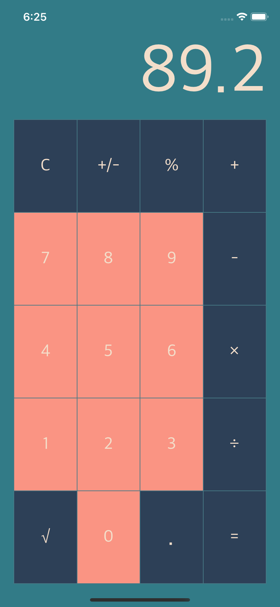
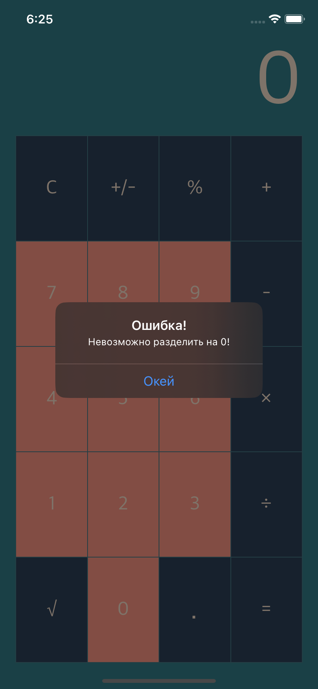

# Calc

Учебное приложение калькулятор с простыми операциями.

Создано в рамках курса и для отработки следующих навыков:
- Работа с AlertController
- Верстка интерфейса через IB и расстановка констрейнтов. 
- Повторение основных возможностей и конструкций Swift

    
    

## TODO:
- [ ] добавить удаление одного символа из строки ввода с помощью жеста.
